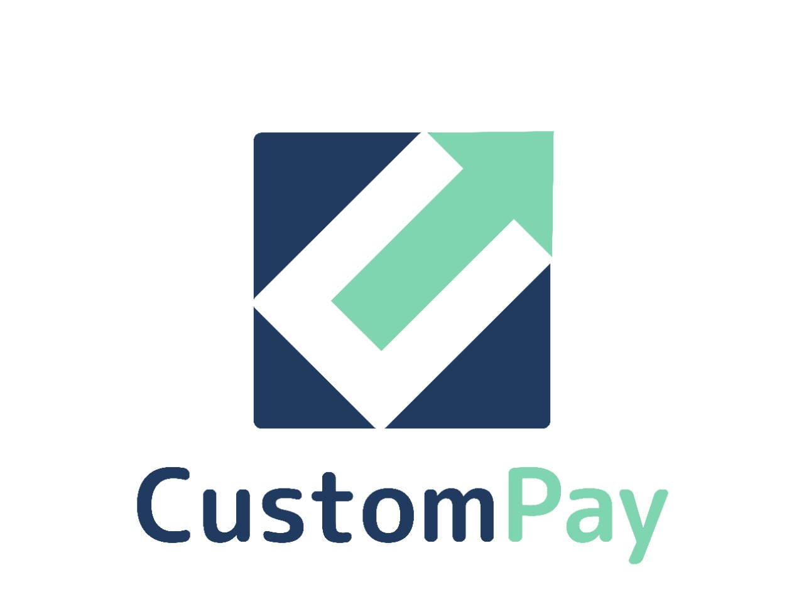

   

Descrição

  Built by
    <a href="https://github.com/custompay/custompay-server">CustomPay</a>
  

# :pushpin: Tabela de Conteúdo

* [Tecnologias](#computer-tecnologias)
* [Funcionalidades](#rocket-funcionalidades)
* [Repositórios](#computer-Repositórios)
* [Equipe](#equipe)
* [License](#closed_book-license)
* [Equipe](#bulb-Equipe)

## 📥 Layout disponivel em:  

    

### Mobile Screenshot

   

# :computer: Tecnologias
Esse projeto foi feito utilizando as seguintes tecnologias:

  
Mobile

-   [VS Code](https://code.visualstudio.com/)

# :rocket: Funcionalidades

- Func 1.

- Func 2.

# :bulb: Equipe
- [Henrique](https://www.linkedin.com/in/henriquegomess/)
- [João](https://www.linkedin.com/in/paulodocarmo/)
- [Julia](https://www.linkedin.com/in/julia-demuner/)
- [Thainá](https://www.linkedin.com/in/thaina-monteiro/)

# :closed_book: LICENSE

Esse projeto está sobre [MIT license](./LICENSE).
