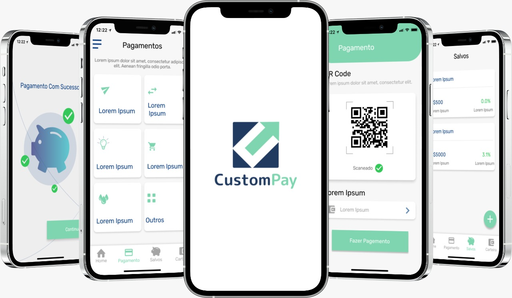

   

Um aplicativo que funciona como uma carteira digital, aonde cada usuário poderá fazer a gestão dos seus gastos e dividir as compras em e-commerce de vestuário entre os diferentes cartões que eles já possuem.

A CustomPay permite realizar pagamentos via QrCode, sem a necessidade dos cartões físicos, além de garantir facilidade e comodidade aos usuários por disponibilizar o controle das suas despesas em um único lugar.

  Built by
    <a href="https://github.com/custompay/custompay-server">CustomPay</a>
  

# :pushpin: Tabela de Conteúdo

* [Tecnologias](#computer-tecnologias)
* [Funcionalidades](#rocket-funcionalidades)
* [License](#closed_book-license)
* [Equipe](#bulb-Equipe)

## 📥 Layout disponivel em:  

    

### Mobile Screenshot

   

# :computer: Tecnologias
Esse projeto foi feito utilizando as seguintes tecnologias:

  
Mobile

-   [VS Code](https://code.visualstudio.com/)
-   [Javascript](https://developer.mozilla.org/pt-BR/docs/Web/JavaScript)
-   [NodeJs](https://nodejs.org/en/)
-   [ExpressJs](https://expressjs.com/pt-br/)
-   [Api PaySmart (Processadora Leve)](https://paysmart-api.gitlab.io/processadora/spec/)
-   [Serviço Cloud](https://www.heroku.com/)
-   [Insomnia](https://insomnia.rest/)

# :rocket: Funcionalidades

- Realizar pagamentos via QR code em e-commerces garantindo facilidade e flexibilidade.

- Controle das despesas de todos os cartões em um único lugar.

# :bulb: Equipe
- [Henrique](https://www.linkedin.com/in/henriquegomess/)
- [João](https://www.linkedin.com/in/paulodocarmo/)
- [Julia](https://www.linkedin.com/in/julia-demuner/)
- [Thainá](https://www.linkedin.com/in/thaina-monteiro/)

# :closed_book: LICENSE

Esse projeto está sobre [MIT license](./LICENSE).
